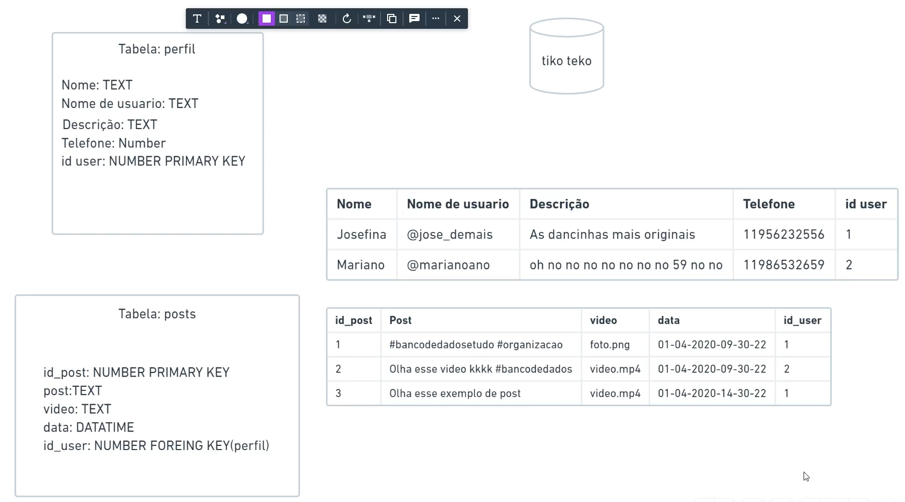
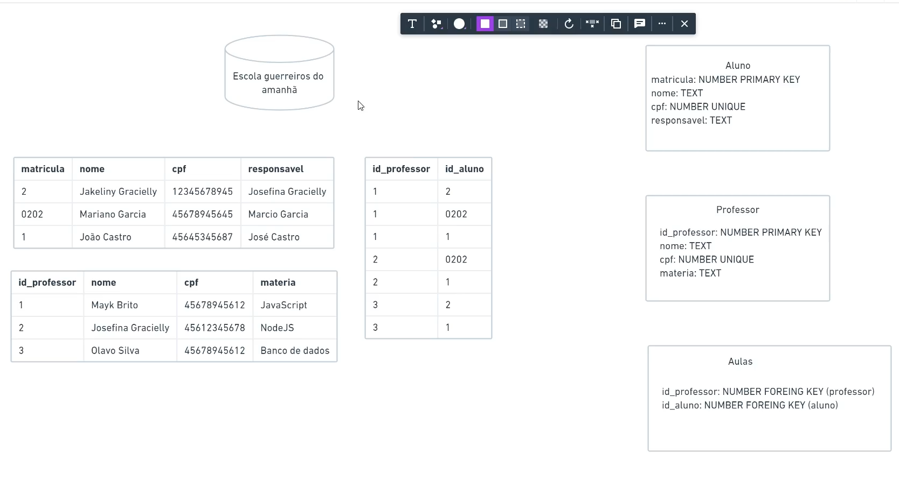
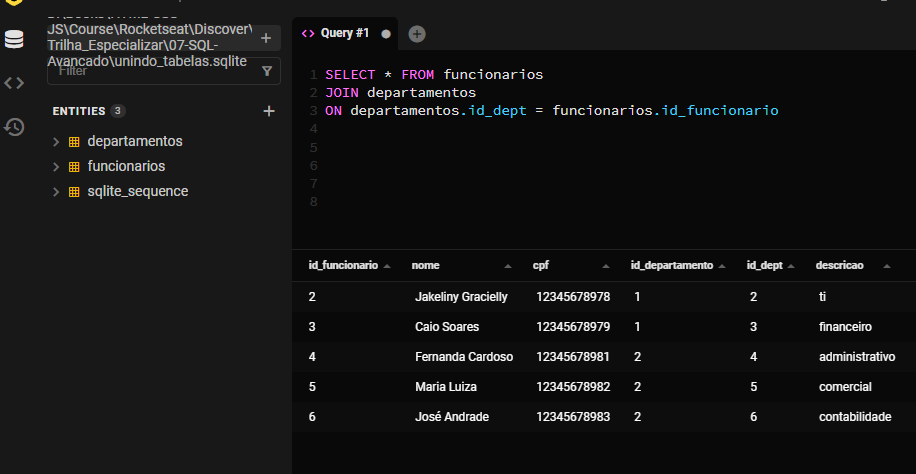
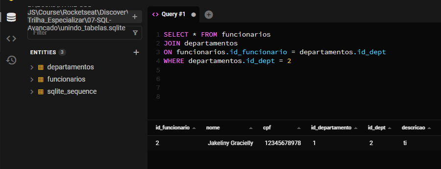
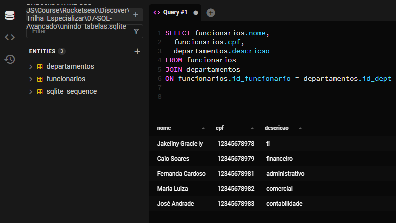
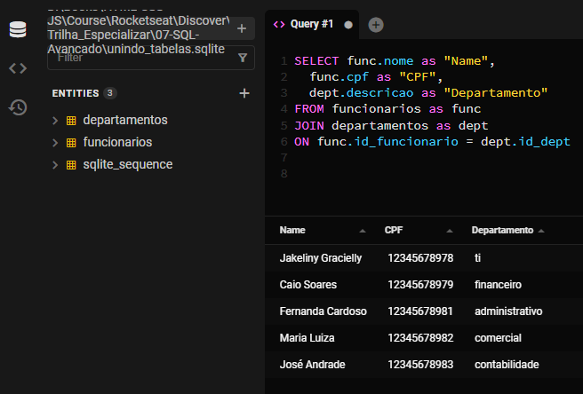
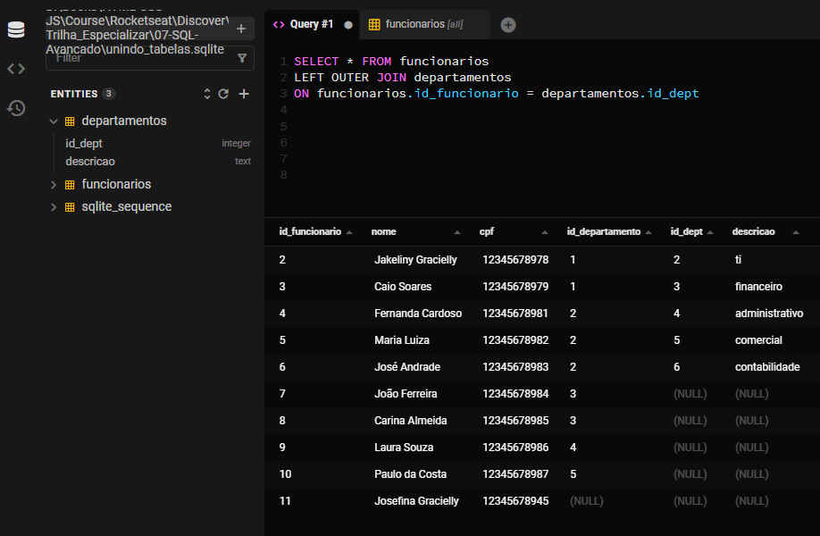
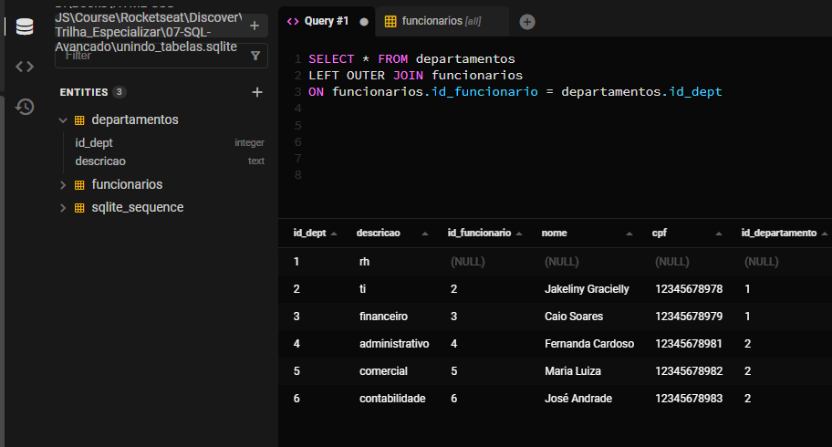
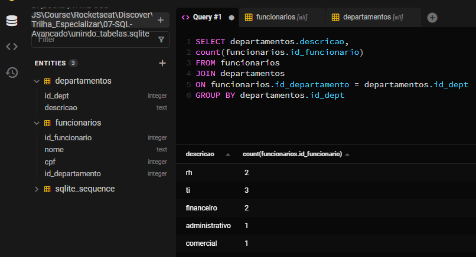

# SQL Avançado
## Tipos de campos
- Foreign Key
    > Responsavel pela relação entre uma tabela com a outra
    - Representa a `PRIMARY KEY` de uma outra tabela
    - Pode ser repetida várias vezes
    
- Unique
    > Indica que o tipo de dados nao pode ser repetido... Ex: `username`.
- Exemplo Escola
    

## Unindo tabelas
#
# `JOIN`


#
# `JOIN` com `WHERE`


#
# `JOIN` especificando campos


#
# `Alias` = as


#
# `LEFT OUTER JOIN`
> Mostra todo o conteudo da tabela `FROM`, mesmo que mesmo que não um relacionamento no `ON`





#
# Comandos avançados
```SQL
    SELECT * FROM aluno
    ORDER BY nome

    SELECT * FROM professor
    ORDER BY materia DESC
```

#
# LIMIT
> Para colocar um limite de resultados

```SQL
    SELECT * FROM aluno LIMIT 2
```

#
# OFFSET
> Ignora os primeiros `n` resultados encontrados

```SQL
    SELECT * FROM funcionarios
    LIMIT 4 OFFSET 2
```

#
# COUNT

```SQL
    SELECT count(nome) FROM funcionarios
```

#
# GROUP BY

```SQL
    SELECT id_dept, count(id_dept) 
    FROM departamentos
    GROUP BY id_dept
```

#
# JOIN, GROUP BY, count()

```SQL
    SELECT departamentos.descricao, 
    count(funcionarios.id_funcionario) 
    FROM funcionarios
    JOIN departamentos
    ON funcionarios.id_departamento = departamentos.id_dept
    GROUP BY departamentos.id_dept 
```


#
# HAVING
> Para comparar agrupamentos

```SQL
    SELECT departamentos.descricao, count(funcionarios.id_departamento) 
    FROM funcionarios
    JOIN departamentos
    ON funcionarios.id_departamento = departamentos.id_dept
    GROUP BY departamentos.id_dept
    HAVING count(funcionarios.id_departamento) > 1
```

#
# Comandos nas Tabelas
# CREATE TABLE

```SQL
    CREATE TABLE alunos (
        matricula INTEGER PRIMARY KEY AUTOINCREMENT,
        nome TEXT,
        cpf INTEGER UNIQUE,
        responsavel TEXT
    )

    CREATE TABLE professores(
        id_professor INTEGER PRIMARY KEY AUTOINCREMENT,
        nome TEXT,
        cpf INTEGER UNIQUE,
        materia TEXT
    )

    CREATE TABLE aulas (
        id_professor INTEGER,
        matricula INTEGER,
        FOREIGN KEY(id_professor) REFERENCES professores(id_professor)
        FOREIGN KEY(matricula) REFERENCES alunos(matricula)
    )
```

#
# ALTER TABLE

```SQL
    ALTER TABLE alunos RENAME TO studens;

    ALTER TABLE professores RENAME TO teachers;

    ALTER TABLE aulas RENAME TO lessons;

    ALTER TABLE lessons RENAME COLUMN matricula TO matriculation_student
```

#
# DROP TABLE

```SQL
    DROP TABLE test
```