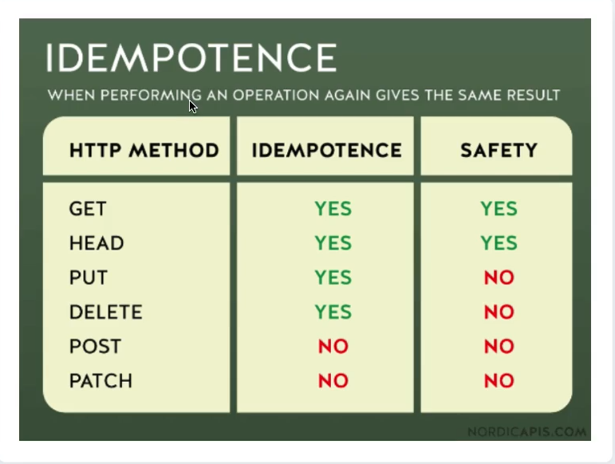
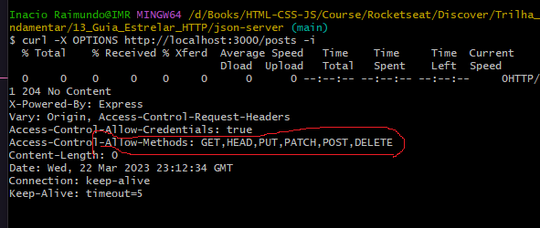

# HTTP (`HyperText Transfer Protocol - Protocolo( conjunto de regras ) de Transferência de HyperTexto`)
* Permite troca de informações e dados na internet
* Uma troca de mensagens
* HTML, CSS, Scripts, Imagens, Vídeo
* Uma chamada para cada um desses recursos
#
## Message    
- ### `Pedido (request)`
  
  - Methods

    - Definição do tipo de pedido
    - Qual ação eu quero fazer no servidor
    - EX: 

      - `GET`: Pegar um recurso
      - `POST`: Criar um recurso
  - Headers
  - Body
- ### `Resposta (response)`

  - Status Code
    
    - Resposta do servidor sobre o estado do pedido/resposta
    - Exemplo: 

        - 200: `Deu certo`
        - 301: `Pedido de redirecionamento`
        - 404: `Página não encontrada`
        - 500: `Página encontrada, mas com algum erro`
  - Headers (Opcional)
  - Body (Opcional) 

- ### `Request / Response`

    - Headers

        - Campos informativos
        - Propriedade: Valor
        - Exemplo: 

            - Content-Type: `application/json`
            - User-Agent: `Chrome`
            - Request URL: `www.google.com`
    - Body

        - HTML
        - Conteúdo
        - JSON

## Conceitos (http)
  #
  - ### Simples
    - Legível
    - `Qualquer pessoa`

  - ### Cliente/Servidor
    - Requisição / Resposta
    - `Pedir um lanche`

  - ### Stateless (Nao guarda estado)
    
    - Não guarda informações
    - Não existe relação entre conexões
    - Jogar uma moeda
    - Sessões

      - Cookies (Rastros de informações ou histórias da navegação)
      - Storeges

  - ### Extensivel
    
    - Através do cabeçalho, podemos fazer diversas trocas de informações entre cliente-servidor, conforme a necessidade.
    - Header
    - Body

## Cliente
  #
  - ### Quem é? 
    #
    - User Agent

      - Browser
      - cURL
    - Entidade que dá início a comunicação
  - ### Pedidios
    #
    - Ações do cliente (envolvem métodos/verbos http)

      - GET (Pedir algum dado)
      - POST (Enviar algum dado)
      - PUT (Atualizar algum dado)
      - DELETE (Deletar algum dado)

## Servidor
  #
  - Como uma máquina
  - Preparado para ouvir e processar
  - Vários servidores em um só computador
  - Resposta 

    - Status Code

      - `404`
      - `500`

## Proxies
  #
  - Representantes
  - Entre o `Cliente` e o `Servidor`
  - Ajuda a fazer o transporte dos dados
  - Diversas funções 

    - `Cach` (ajuda a devolver uma informação mais rápido)
    - `Filtro` (como um vírus, ou controle parental)
    - `Load balancing` (distribuição da carga)
    - `Autenticação`
    - `Autorização`

## URL (`Uniform Resource Identifier`)

  - ### Conceito
    #
    - Identificar um recurso
    - Nome ou Localização
    - Ex:

      - Você é um recurso
      - Seu nome
      - Sua localização

  - ## Resource (`Alvo do pedido`)

    - ### Qualquer coisa identificável / Entidade
      #
      - Digital

        - Email: `mailto:inacio@gmail.com`
      - Abstrata

        - `Sessão`
        - `Autenticação`
      - Física

        - `Produtos`
        - `Usuários`
      - Se podermos identificar, nomear, endereçar ou manipular estamos falando de um `recurso`

  - ## Locator 

    - URL (Uniform Resource Locator - `www.google.com`)

      - Componentes
        
        - Obrigatórios

          - Protocolo - `'https'`
          - Dominio - `google.com`
        - Opcionais

          - Subdominio (antes do domínio - `www.`): é opcional
          - Path (caminho https://www.rocketseat.com.br`/blog`)
          - Parametros (https://www.youtube.com/watch`?v=vpYct2npKD8`)
          - Porta (http://127.0.0.1`:3333` - após um IP)
          - Âncora (algum local dentro do doc. www.google.com/index.html`#something`)

## URN (Uniform Resource Name)

  - Ex: 
  
    - `urn:isbn:0451450523`
    - `urn:oasis:names:specification:docbook:dtd:xml:4.1.2`

## HTTP Messages

  - Mensagem
  - HTTP/1.1 (versão antiga)

    - Legível
    - Texto
  - HTTP/2 (versão actual/moderna)

    - Estrutura binária
    - Otimizações
    - Mesma maneira que a versão 1.1

## Request Message (Pedido)

  - ### Request Line (`curl -v https://www.google.com`)
    - Method (`Verbos`)
    - Protocol version
    - URI
  - ### Body
  - ### Headers

## Response Message (Resposta)

  (`curl -i https://www.google.com`) - retorna os `headers` e `bodies`
  - Protocolo Version
  - Status code (diz se deu certo ou não)
  - Headers
  - Status message

## Methods & Verbos http

  - Servem para identificar o que vamos fazer ou qual operação queremos fazer numa determinada `url`.
  - Define u conjunto de métodos `HTTP`
  - Indica a ação que o cliente deseja operar
  - Podem ser chamados de `Verbos HTTP`
  - Cada um possui a sua semântica (significado ou maneira de operar)
  - Características

  - SEGUROS (`https://www.google.com`)
    - Não altera o estado do servidor
    - Somente leitura (`https://www.google.com`)
    - Cliente não solicita alterações
    - Não há carga extra para servidor
    - O servidor é responsável em manter o método seguro
    - `Quais são`:
      - `GET`: GET /search.html HTTP/1.1
      - `HEAD`
      - `OPCIONS`
  - IDEMPOTENTES (`idem` - igual`)

    
    - Ao executar o método, a resposta deverá ser sempre a mesma
    - `Quais são`:
      
      - Todos os seguros são `idempotentes`
      - `PUT`: (não faz parte dos `seguros`, porque faz alterações no servidor)
      - `DELETE`: (não faz parte dos `seguros`, porque faz alterações no servidor)
    - Status code poderá ser diferente
    - O servidor tem a responsabilidade de retornar dados da mesma maneira
    - Essa especificação não é garantia de que todos os servidores irão aplicar o conceiro corretamente.
    
## DNS 
  > Informação sobre a disponibilidade da requisição

  
  - OPTIONS/index.html HTTP/1.1
  - OPTIONS * HTTP/1.1
    > curl -X
    - Características
      - Seguro: `YES`
      - Idempotente: `YES`
      - BODY
        - Request: `NO`
        - Response: `NO`
      - Uso em formulários HTML: `NO`
      - Cacheable: `NO`

  - ### GET
    > curl -v
    - Pegar recurso
    - Somente recebe dados
    - Características
      - Seguro: `YES`
      - Idempotente: `YES`
      - BODY
        - Request: `NO`
        - Response: `YES`
      - Uso em formulários HTML: `YES`
      - Cacheable: `YES`

  - ### HEAD 
    > curl -I
    - Semlhante ao GET, porém...
    - ...recebe somente o cabeçalho - `HEAD/posts`
    - Características
      - Seguro: `YES`
      - Idempotente: `YES`
      - BODY
        - Request: `NO`
        - Response: `NO`
      - Uso em formulários HTML: `NO`
      - Cacheable: `YES`

  - ### POST 
    > curl -d '{ "id": 2, "title": "json-server-2", "author": "IMR" }' -H "Content-type: application/json" -X POST http://localhost:3000/posts

    - Publicar/Cadastrar um ecurso
    - Características
      - Seguro: `NO`
      - Idempotente: `NO`
      - BODY
        - Request: 
        - Response: 
      - Uso em formulários HTML: `YES`
      - Cacheable: 

  - ### PUT 
    > curl -d '{"name": "Inacio"}' -H 'Content-type: application/json' -X PUT http://localhost:3000/profile

    - Criar um novo ou atualizar um recurso
      - PUT/profile HTTP/1.1
      - Diferença entre POST?
      - Criação - Status code 201
      - Atualização - Status code 204 ou 200
    - Características
      - Seguro: `NO`
      - Idempotente: `YES`
      - BODY
        - Request: `YEAS`
        - Response: `NO`
      - Uso em formulários HTML: `NO`
      - Cacheable: `NO`

    - ### PATCH 
    > curl -d '{ "title": "title-test"}' -H "Content-type: application/json" -X PATCH http://localhost:3000/posts/1

    - Modificação parcial de um recurso
      - Diferença entre o PUT
      - PATCH /posts/1 HTTP/1.1
    - Características
      - Seguro: `NO`
      - Idempotente: `NO`
      - BODY
        - Request: `YEAS`
        - Response: `YES`
      - Uso em formulários HTML: `NO`
      - Cacheable: `NO`

      - ### PATCH 
    > curl -X DELETE http://localhost:3000/posts/2

    - Remove um recurso
      - Diferença entre o PUT
      - PATCH /posts/1 HTTP/1.1
    - Características
      - Seguro: `NO`
      - Idempotente: `YES`
      - BODY
        - Request: `POSSIBILIDADE`
        - Response: `POSSIBILIDADE`
      - Uso em formulários HTML: `NO`
      - Cacheable: `NO`